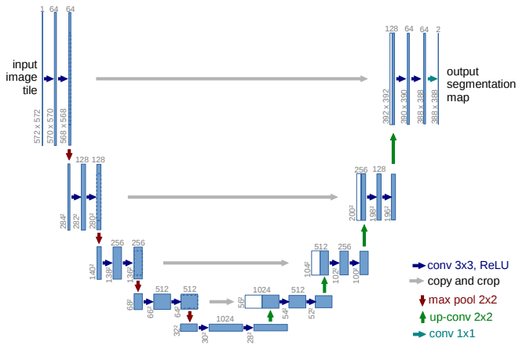
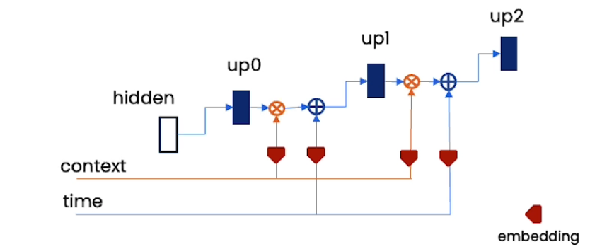

# Description

D-Soft: Research and Implement Image-to-Video application

## Table of contents

- [Approach methods](#approach-methods)
- [SOTA models](#sota-models)
- [Model Architecture](#model-architecture-u-net)
- [Fine-Tuning](#fine-tuning-pre-trained-model)
- [Applications](#applications)
- [OpenAI API](#openai-api)

### Approach methods

1. Variational Autoencoder (VAE): Encode images to a compressed size, then decode back to the original size, while learning the distribution of the data

2. Generative Adversarial Network (GAN): They have two parts (the Generator and the Discriminator) that help each other get better. The Generator learns to make data that looks real, and the Discriminator learns to tell the difference between real and fake data.

3. Flow-based Generative Model: Create new data that’s similar to the data they were trained on and then calculate how likely a certain output is

4. Auto-Regressive Model: Model the conditional probability of each pixel given previous pixels. Then use the probability distribution to generate new data

5. Diffusion Model: Systematically and slowly destroy struture in data distribution though an iterative ``forward diffusion process``. We then learn a ``reverse diffusion process`` that restores structure in data, yielding a highly flexible and tractable generative model of the data.

### SOTA models

1. [Stable video diffusion (SDM):](https://static1.squarespace.com/static/6213c340453c3f502425776e/t/655ce779b9d47d342a93c890/1700587395994/stable_video_diffusion.pdf)

2. [Laten flow diffusion model (LDM):](https://arxiv.org/pdf/2303.13744.pdf)

3. [Cascade diffusion model (CDM):](https://arxiv.org/pdf/2311.04145.pdf)

### Model Architecture (U-NET)

1. **Encoder**: Extract features from the input image, reduce the spatial information, and compress the image into a smaller size.

2. **Decoder**: Upsample the features to the original size, and restore the spatial information.

3. **Skip Connections**: Connect the encoder and decoder layers to preserve the spatial information.

4. **Output Layer**: Produce the final segmentation map with the sampe spatial dimension as the input image.

The UNet can take more information in the form of embeddings

- Time embedding: Related to the timestep and noise level

- Context embedding: Control the content of the generated image

### Fine-Tuning Pre-trained Model

1. Download Pretrained Model:

2. Load Pretrained Model

3. Fine Tuning

4. Sampling Function

5. Generation

We can follow this tutorial to fine-tune the model: [Colab](https://colab.research.google.com/github/mkshing/notebooks/blob/main/stable_video_diffusion_img2vid.ipynb)

### Applications

- DALL-E: [Link](https://openai.com/dall-e-3)

- Image GPT: [Link](https://openai.com/research/image-gpt)

- Mid Journey: [Link](https://www.midjourney.com/explore)

- Gen-2 Gen: [Link](https://app.runwayml.com/login)

### OpenAI API

- Authencation: Controls on access to API endpoint services and resources

### Papers

**UNET: Convolutional Networks for Biomedical Image Segmentation** [[Paper](https://arxiv.org/pdf/1505.04597.pdf)]

**High Resolution Image Synthesis and Semantic Manipulation with Conditional GANs** [[Paper](https://arxiv.org/pdf/2112.10752.pdf)]

**Stable Video Diffusion** [[Paper](https://static1.squarespace.com/static/6213c340453c3f502425776e/t/655ce779b9d47d342a93c890/1700587395994/stable_video_diffusion.pdf)]

**Latent Flow Diffusion Models** [[Paper](https://arxiv.org/pdf/2303.13744.pdf)]

**Denoise Diffusion Probabilistic Models** [[Paper](https://arxiv.org/pdf/2006.11239.pdf)]
